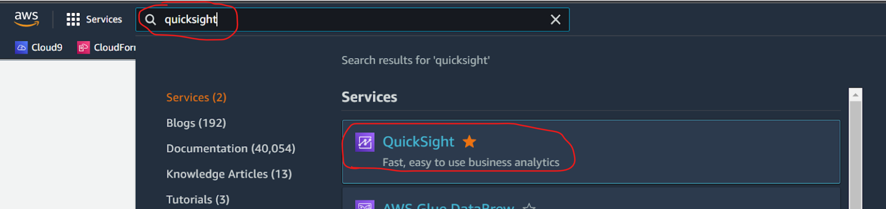
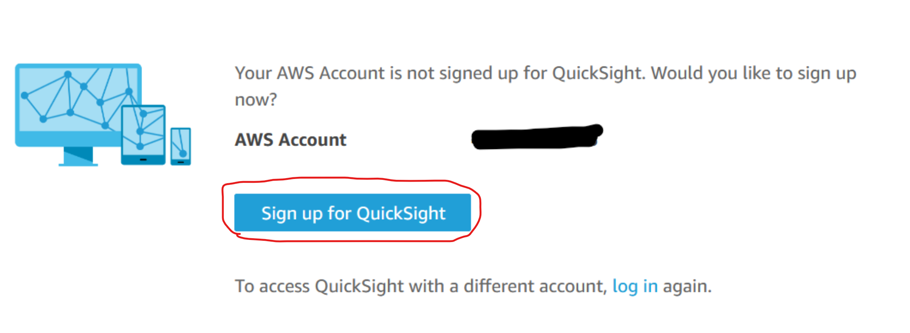
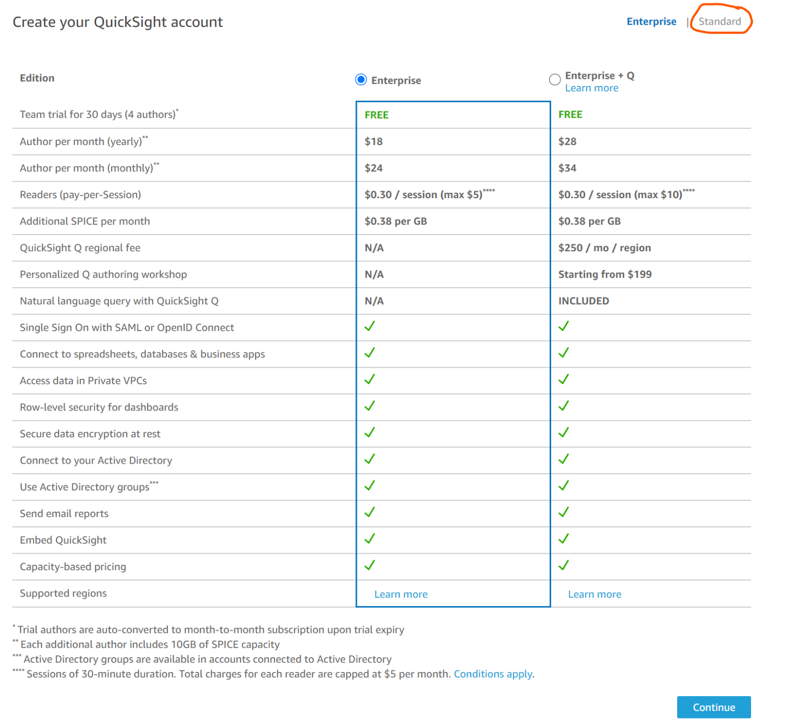
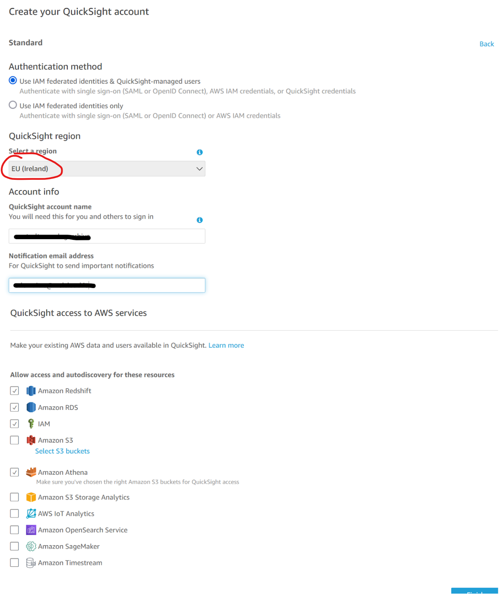
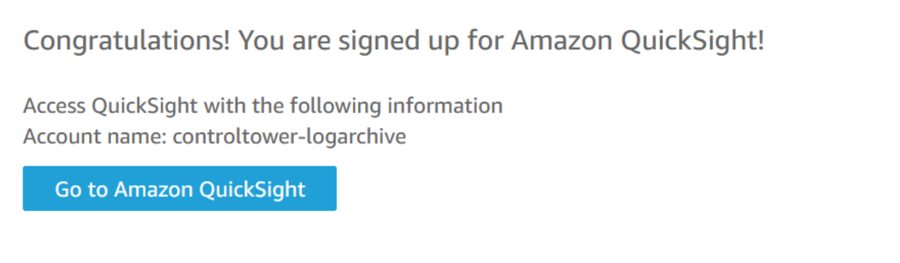
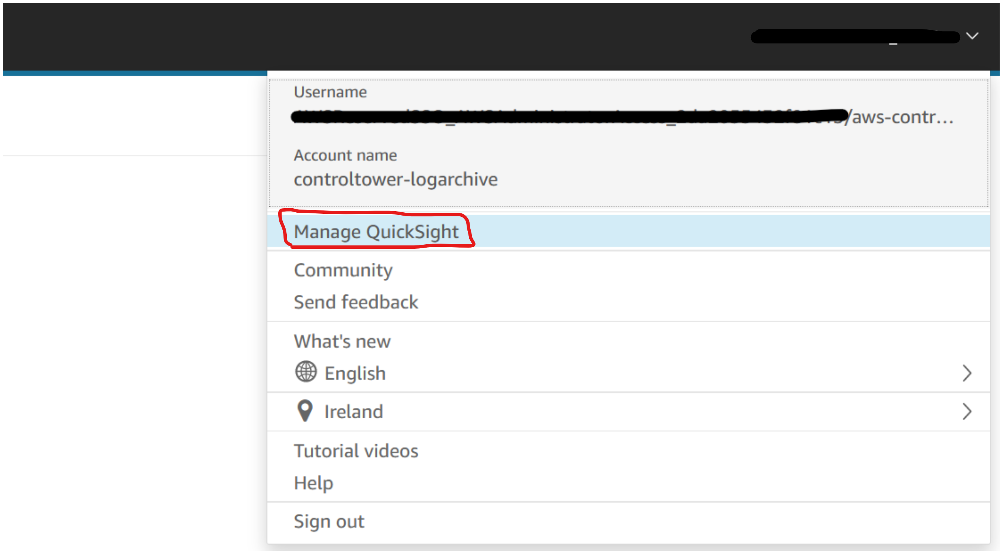
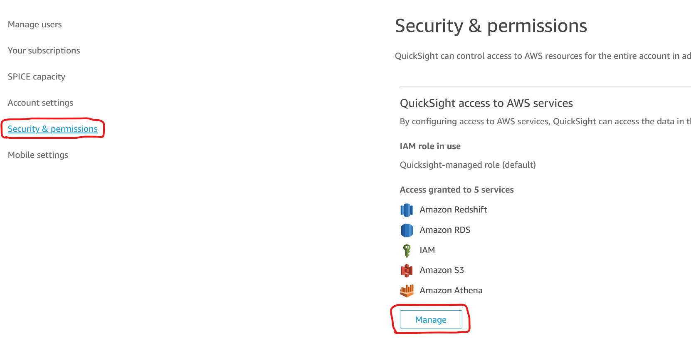
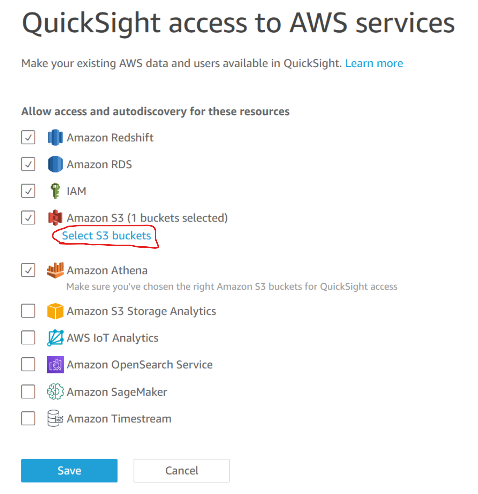
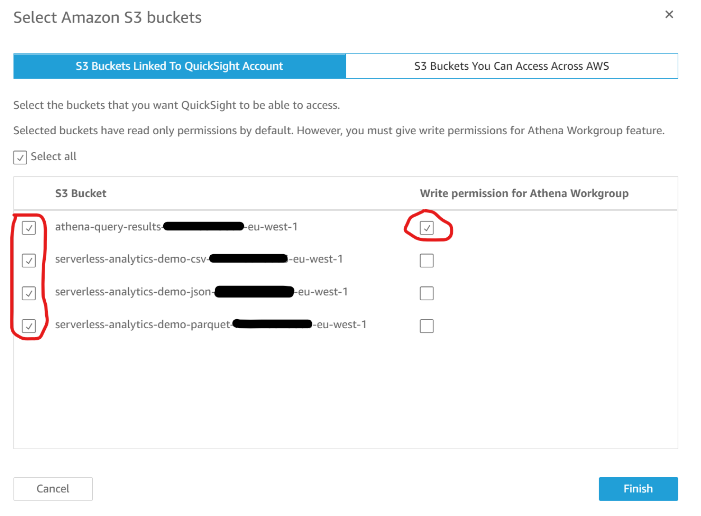
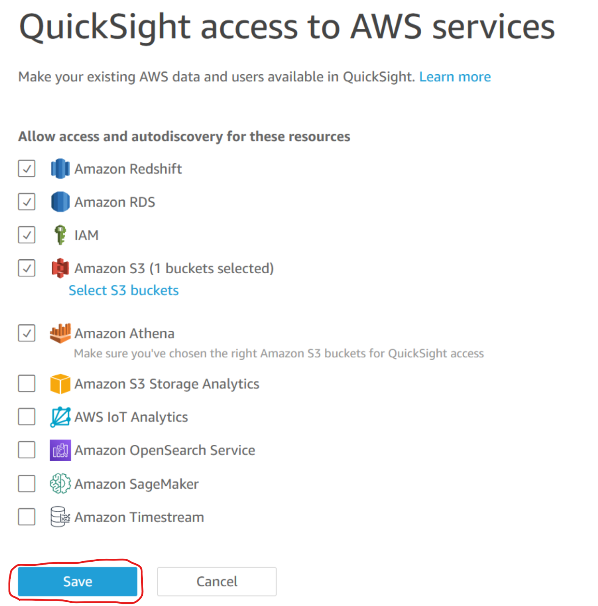

# QuickSight Access Setup

- #### Search and click on QuickSight in the AWS console

- #### Click on "Sign up for QuickSight"

- #### Click on "Standard Edition"

- #### Configure account parameters

    - Select a region (e.g Ireland)
    - Give the account a name (e.g. MyQuickSightAccount)
    - Give a notification email (e.g. you@domain.com)
    - Leave default values for the rest

- #### Click on "Go to Amazon QuickSight"

- #### A page like this one should appear

# QuickSight S3 Permissions Setup

- #### Access QuickSight management 

- #### Click on "Manage QuickSight" (Top Right Menu)

- #### Click on "Security and permissions" then click on "Manage"

- #### Click on "Select S3 Buckets" then click on "Manage"

- #### You should select "read" for the buckets you want to read

- #### You should select "write" for query result bucket (the one used by you athena workgroup) 

- #### Click on "Finish"

- #### Click on "Save"

