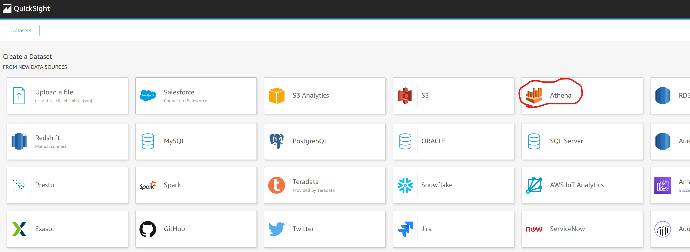
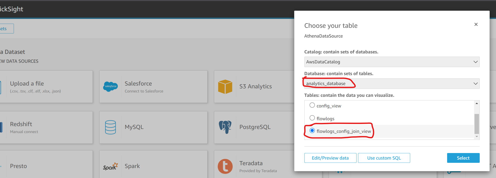
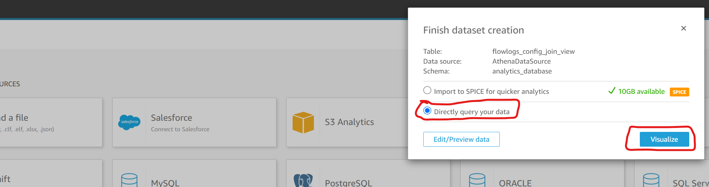
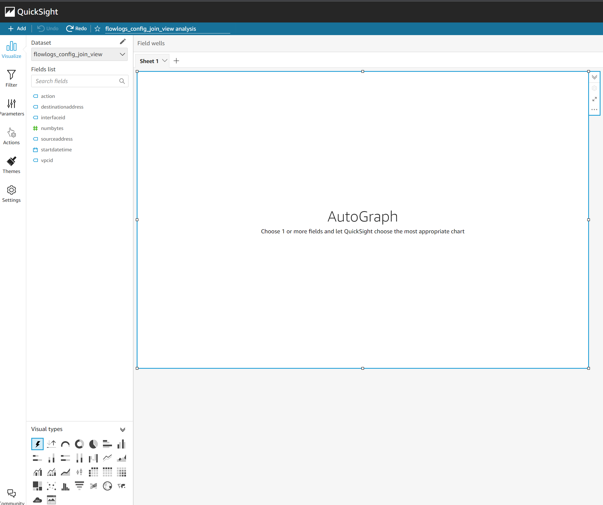

# QuickSight First Visual

- #### Click on "New Dataset"

- #### Click on "Athena" datasource (this will create a new data source)

- #### Choose athena workgroup for the datasource

- #### Choose an athena table or an athena view

- #### Choose "Direct Query" (bot spice) and click "Visualize"

- #### You should then see an empty visual

- #### Select fields & table as visual type to see your first visual

