## Upload more data on s3

From <a href="https://eu-west-1.console.aws.amazon.com/cloudshell" target="_blank">AWS CloudShell</a>
or from your own local terminal configured with iam credentials, run :

```
# Create local data file
cat << EOF > moredata.csv
version account-id interface-id srcaddr dstaddr srcport dstport protocol packets bytes start end action log-status
2 000111222333 eni-0000h23056c6d31kb 10.0.0.240 50.217.198.149 34144 123 17 1 76000000 1652270400 1652270410 ACCEPT OK
2 000111222333 eni-0000h23056c6d31kb 10.0.0.240 50.217.198.149 34144 123 17 1 86000000 1652270400 1652270410 ACCEPT OK
2 000111222333 eni-0000h23056c6d31kb 10.0.0.241 50.217.198.149 34144 123 17 1 96000000 1652270400 1652270410 ACCEPT OK
2 000111222333 eni-0000h23056c6d31kb 10.0.0.241 50.217.198.140 34144 123 17 1 16000000 1652270400 1652270410 ACCEPT OK
2 000111222333 eni-0000h23056c6d31kb 10.0.0.242 50.217.198.140 34144 123 17 1 26000000 1652270400 1652270410 ACCEPT OK
2 000111222333 eni-0000h23056c6d31kb 10.0.0.242 50.217.198.140 34144 123 17 1 36000000 1652270400 1652270410 ACCEPT OK
2 000111222333 eni-0000h23056c6d31kb 10.0.0.242 50.217.198.140 34144 123 17 1 46000000 1652270400 1652270410 ACCEPT OK
2 000111222333 eni-0000h23056c6d31kb 10.0.0.240 50.217.198.149 34144 123 17 1 76000000 1652270400 1652270410 REJECT OK
2 000111222333 eni-0000h23056c6d31kb 10.0.0.240 50.217.198.149 34144 123 17 1 86000000 1652270400 1652270410 REJECT OK
2 000111222333 eni-0000h23056c6d31kb 10.0.0.241 50.217.198.149 34144 123 17 1 96000000 1652270400 1652270410 REJECT OK
2 000111222333 eni-0000h23056c6d31kb 10.0.0.241 50.217.198.140 34144 123 17 1 16000000 1652270400 1652270410 REJECT OK
2 000111222333 eni-0000h23056c6d31kb 10.0.0.242 50.217.198.140 34144 123 17 1 26000000 1652270400 1652270410 REJECT OK
2 000111222333 eni-0000h23056c6d31kb 10.0.0.242 50.217.198.140 34144 123 17 1 36000000 1652270400 1652270410 REJECT OK
2 000111222333 eni-0000h23056c6d31kb 10.0.0.242 50.217.198.140 34144 123 17 1 46000000 1652270400 1652270410 REJECT OK
2 000111222333 eni-0000h23056c6d31kb 10.0.0.240 50.217.198.149 34144 123 17 1 76000000 1652184000 1652184010 ACCEPT OK
2 000111222333 eni-0000h23056c6d31kb 10.0.0.240 50.217.198.149 34144 123 17 1 86000000 1652184000 1652184010 ACCEPT OK
2 000111222333 eni-0000h23056c6d31kb 10.0.0.241 50.217.198.149 34144 123 17 1 96000000 1652184000 1652184010 ACCEPT OK
2 000111222333 eni-0000h23056c6d31kb 10.0.0.241 50.217.198.140 34144 123 17 1 16000000 1652184000 1652184010 ACCEPT OK
2 000111222333 eni-0000h23056c6d31kb 10.0.0.242 50.217.198.140 34144 123 17 1 26000000 1652184000 1652184010 ACCEPT OK
2 000111222333 eni-0000h23056c6d31kb 10.0.0.242 50.217.198.140 34144 123 17 1 36000000 1652184000 1652184010 ACCEPT OK
2 000111222333 eni-0000h23056c6d31kb 10.0.0.242 50.217.198.140 34144 123 17 1 46000000 1652184000 1652184010 ACCEPT OK
EOF

# Create data bucket and upload data file
ACCOUNT_NUMBER=$(aws sts get-caller-identity --query Account --output text)
aws s3 mb s3://serverless-analytics-demo-csv-${ACCOUNT_NUMBER}-eu-west-1 --region eu-west-1
aws s3 cp moredata.csv s3://serverless-analytics-demo-csv-${ACCOUNT_NUMBER}-eu-west-1

# Remove local data file
rm moredata.csv
```

- #### Refresh quicksight with new data
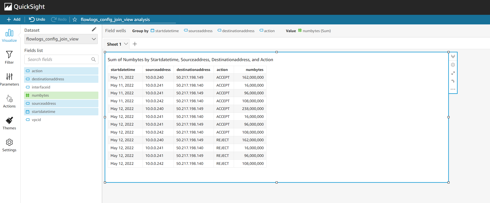

## Use filters

- #### Filter on 'ACCEPT' (Use 'Focus Only on ...' menu)
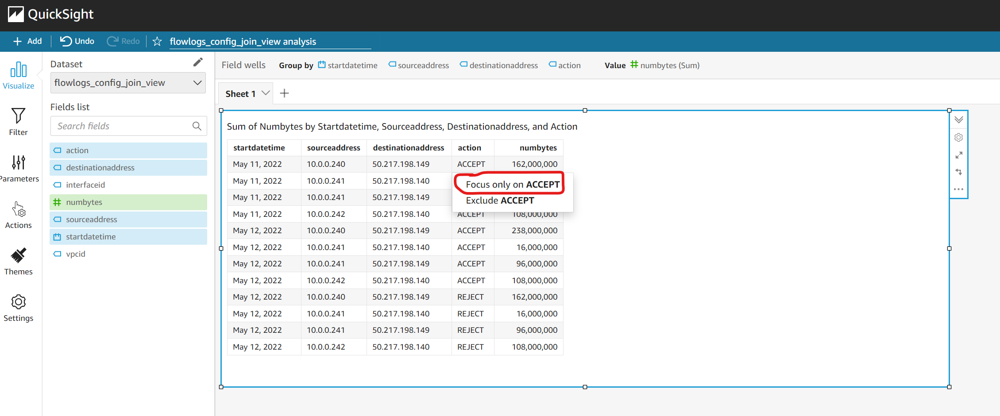

- #### Select filter menu in Quicksight
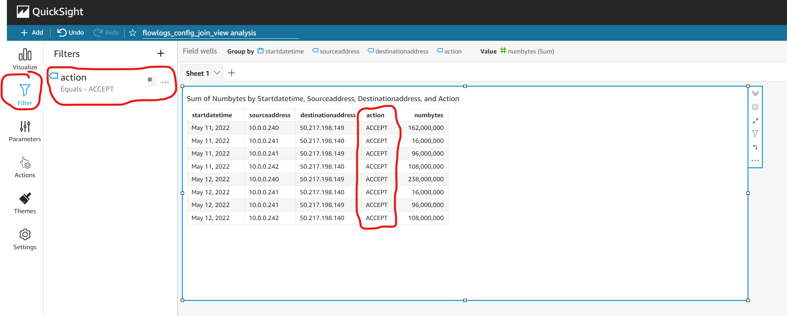

- #### Filter on date
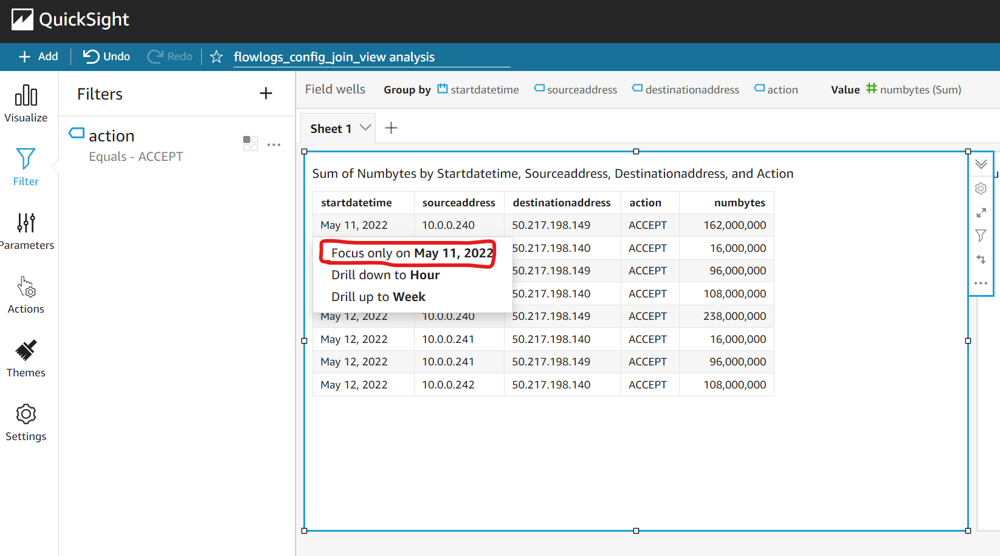

- #### Add filter to sheet
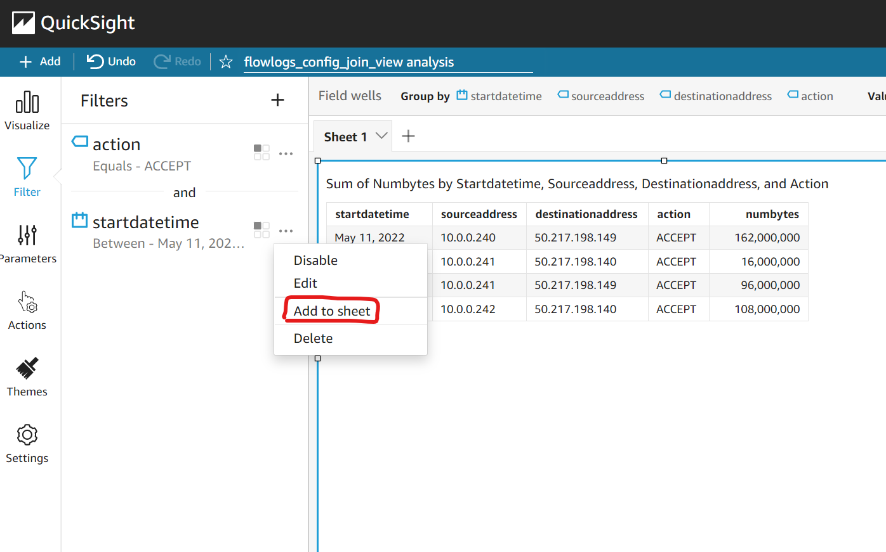

- #### Add filter as control (pin to top)
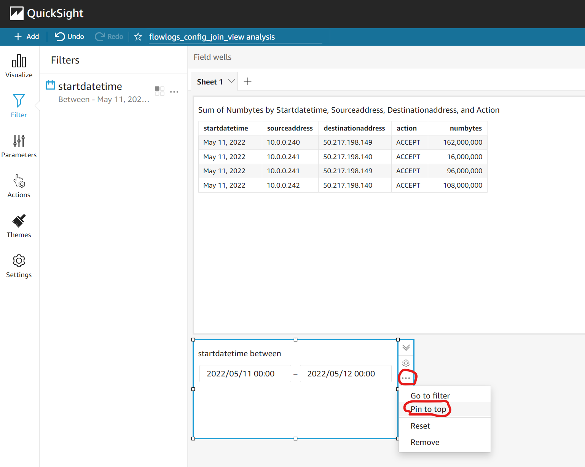

- #### Select a date range
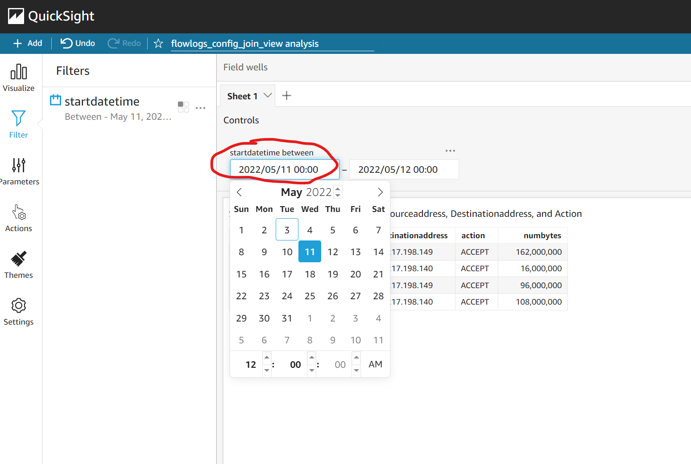

## Use parameters

- #### Create a parameter
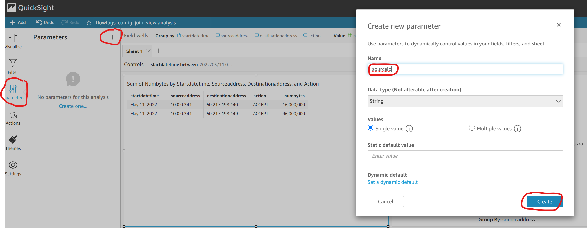

- #### Make parameter as control
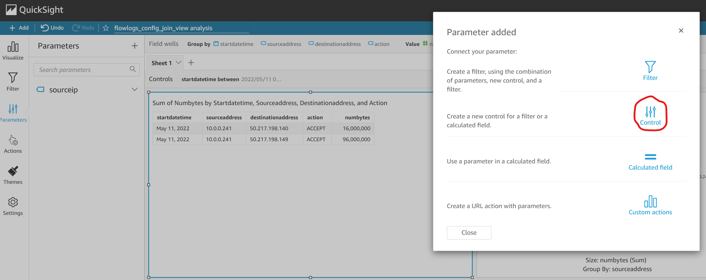

- #### Select the content of the control
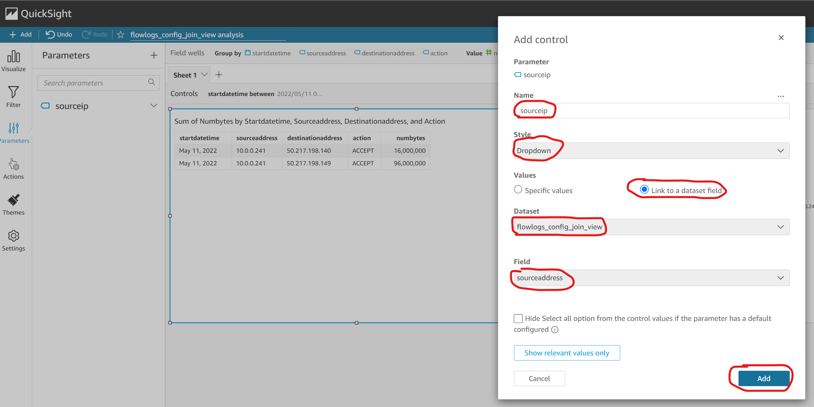

- #### Display control dop down list
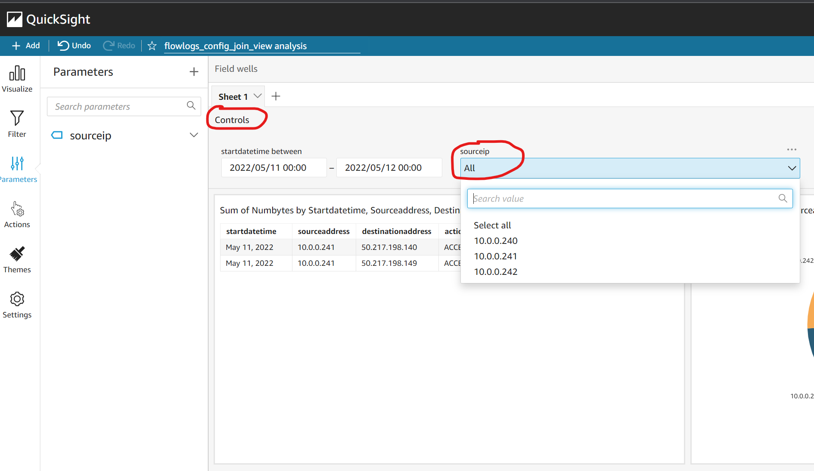

- #### Edit Filter
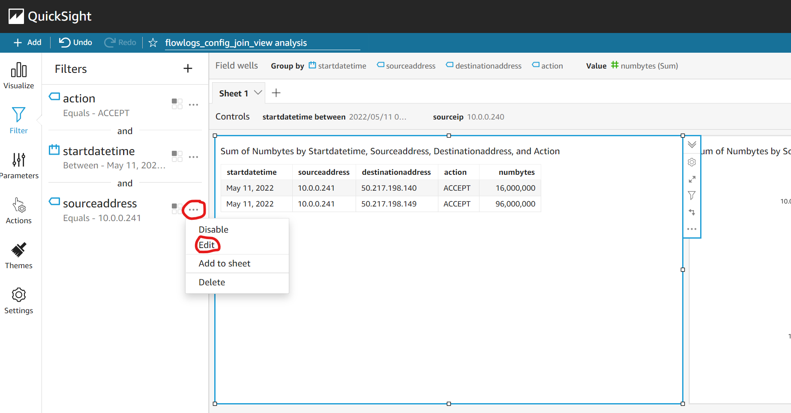

- #### Use parameter in filter
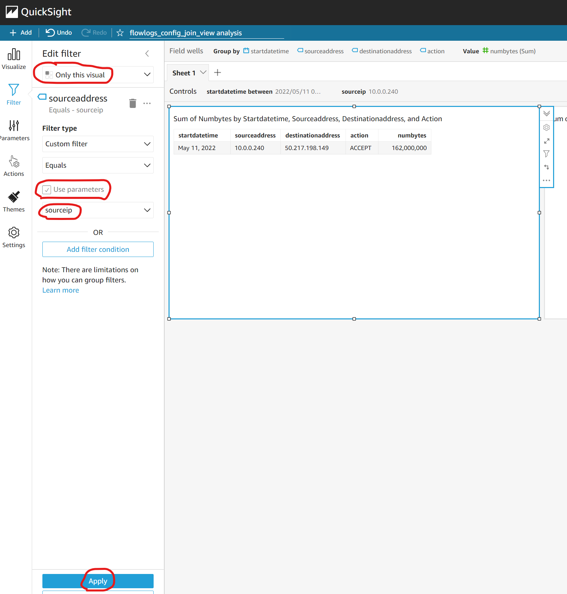

## Use actions

- #### Duplicate Visual
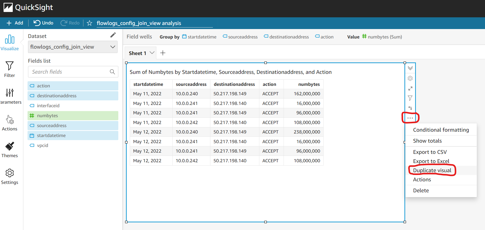

- #### Choose a pie chart and select the right fields
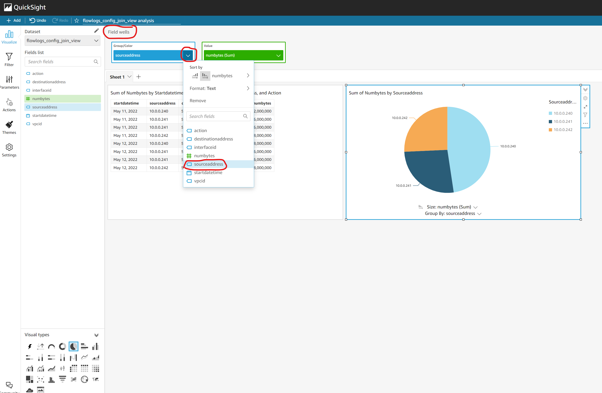

- #### Create new visual
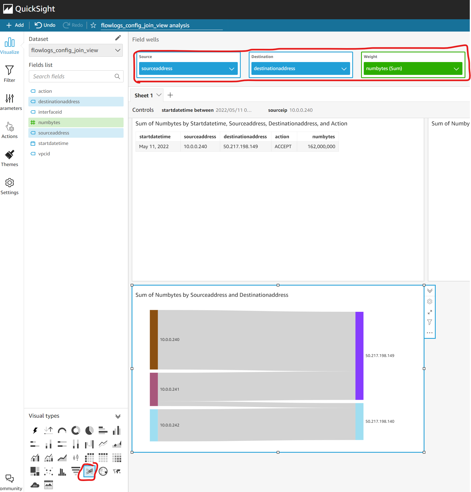

- #### Create action
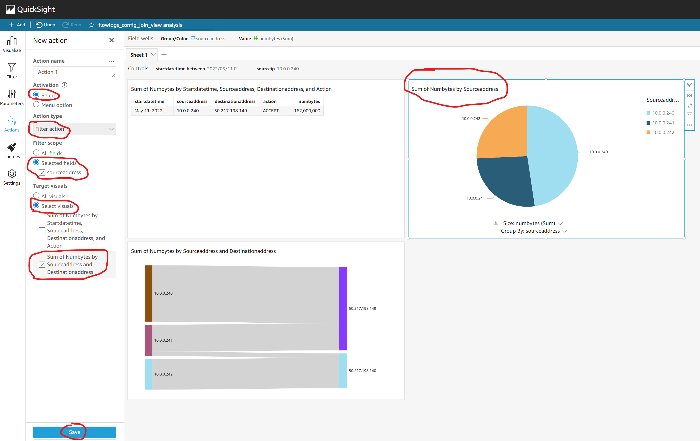

- #### Test Action
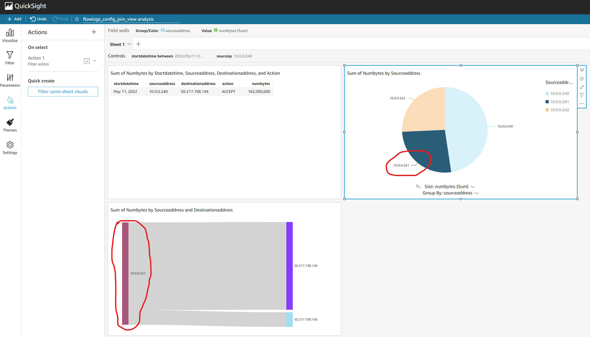