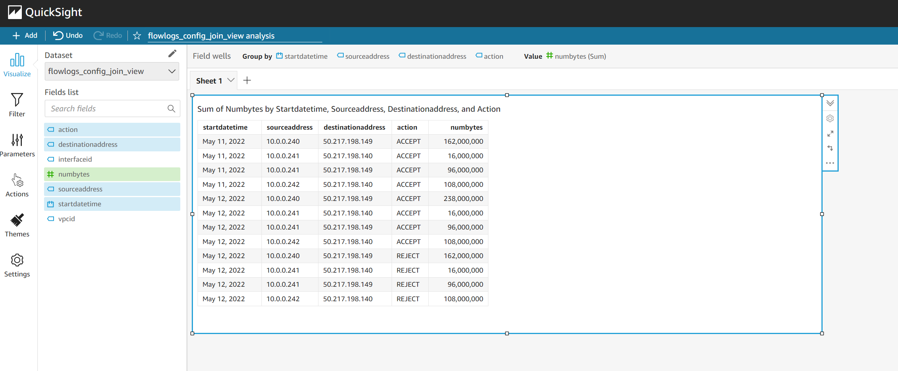
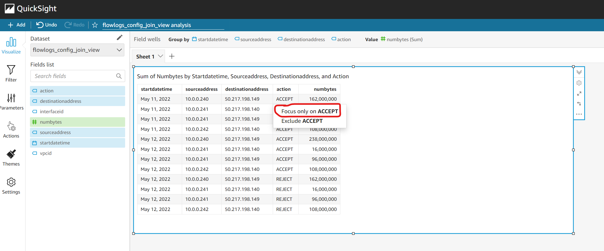
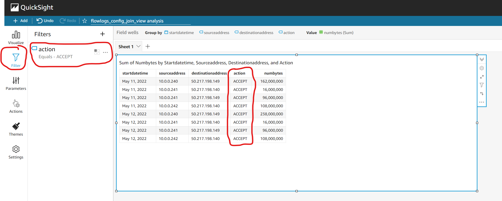
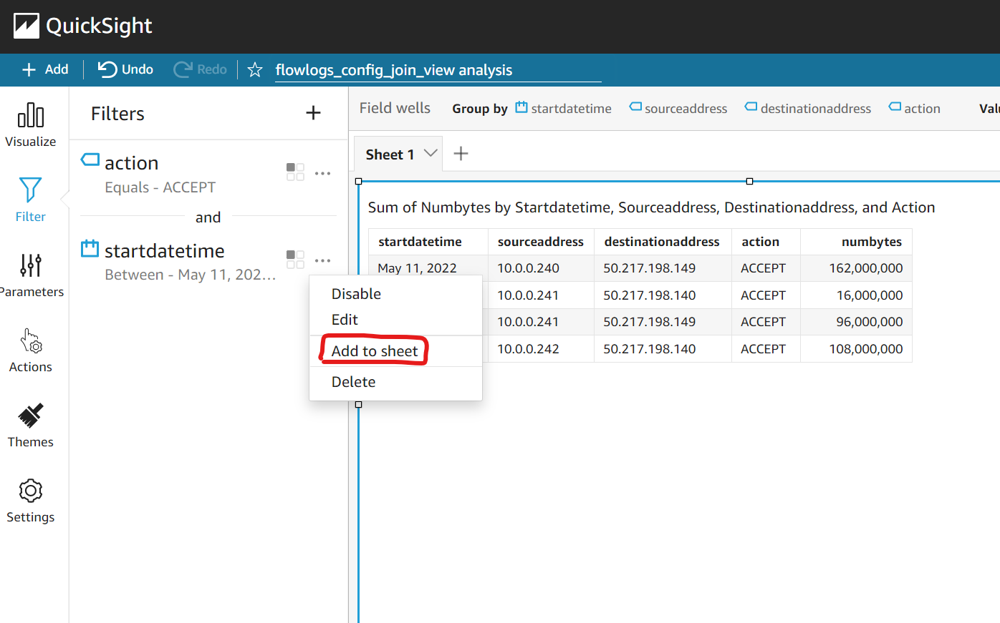
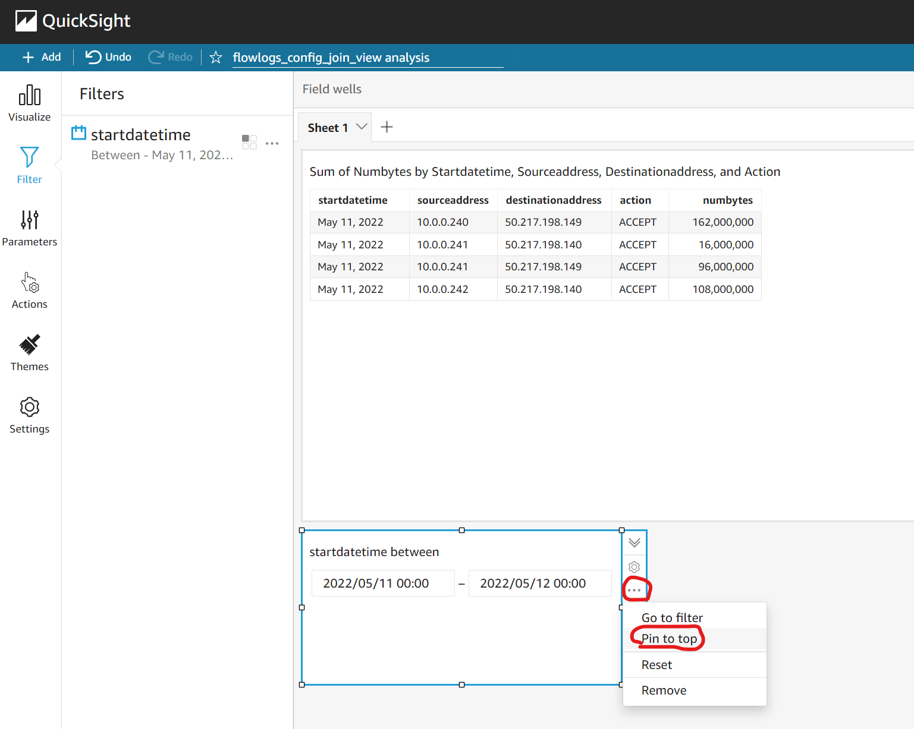
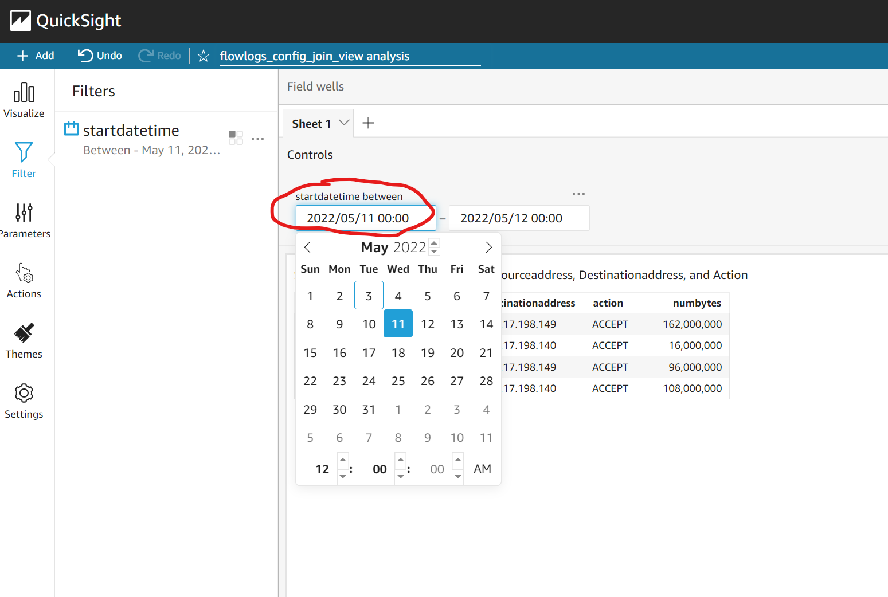
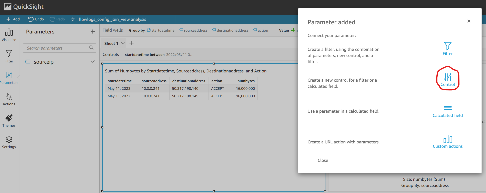
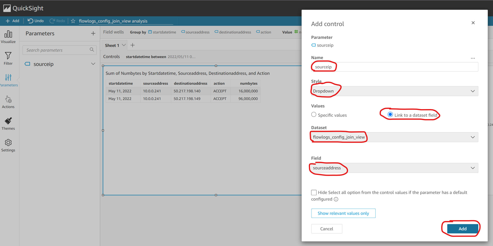
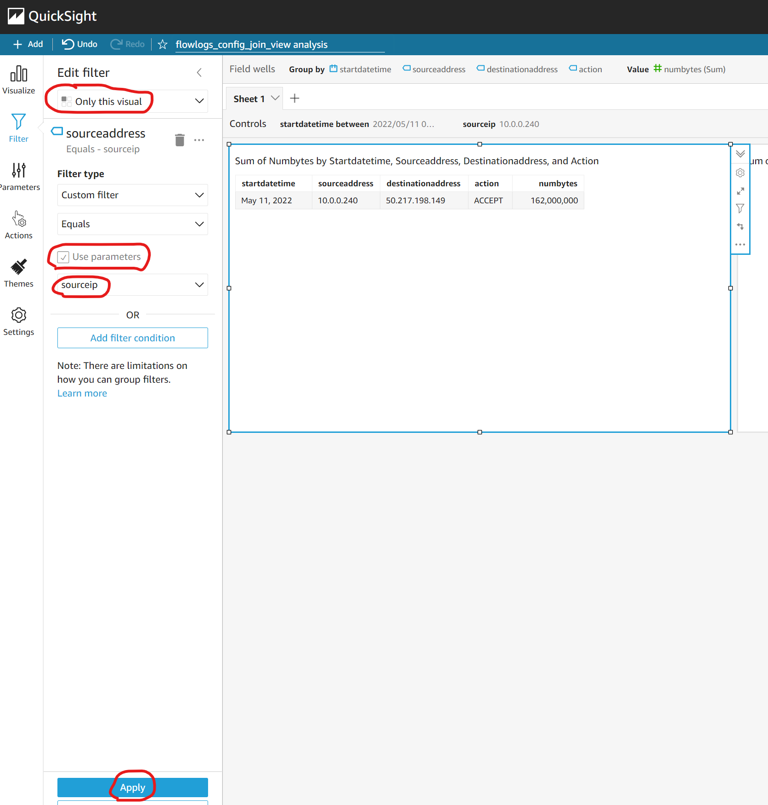
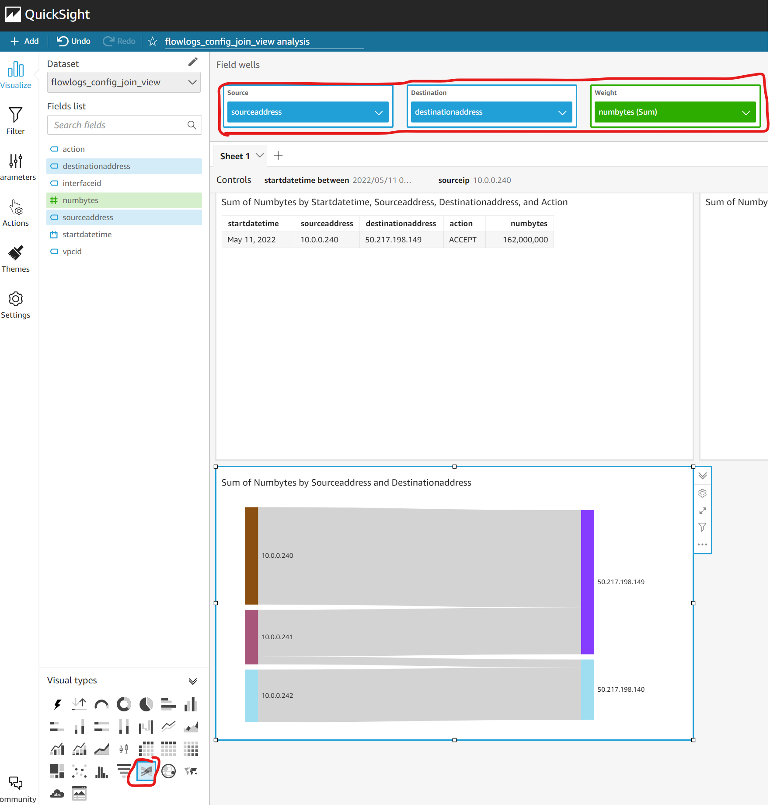

```
# Create local data file
cat << EOF > moredata.csv
version account-id interface-id srcaddr dstaddr srcport dstport protocol packets bytes start end action log-status
2 000111222333 eni-0000h23056c6d31kb 10.0.0.240 50.217.198.149 34144 123 17 1 76000000 1652270400 1652270410 ACCEPT OK
2 000111222333 eni-0000h23056c6d31kb 10.0.0.240 50.217.198.149 34144 123 17 1 86000000 1652270400 1652270410 ACCEPT OK
2 000111222333 eni-0000h23056c6d31kb 10.0.0.241 50.217.198.149 34144 123 17 1 96000000 1652270400 1652270410 ACCEPT OK
2 000111222333 eni-0000h23056c6d31kb 10.0.0.241 50.217.198.140 34144 123 17 1 16000000 1652270400 1652270410 ACCEPT OK
2 000111222333 eni-0000h23056c6d31kb 10.0.0.242 50.217.198.140 34144 123 17 1 26000000 1652270400 1652270410 ACCEPT OK
2 000111222333 eni-0000h23056c6d31kb 10.0.0.242 50.217.198.140 34144 123 17 1 36000000 1652270400 1652270410 ACCEPT OK
2 000111222333 eni-0000h23056c6d31kb 10.0.0.242 50.217.198.140 34144 123 17 1 46000000 1652270400 1652270410 ACCEPT OK
2 000111222333 eni-0000h23056c6d31kb 10.0.0.240 50.217.198.149 34144 123 17 1 76000000 1652270400 1652270410 REJECT OK
2 000111222333 eni-0000h23056c6d31kb 10.0.0.240 50.217.198.149 34144 123 17 1 86000000 1652270400 1652270410 REJECT OK
2 000111222333 eni-0000h23056c6d31kb 10.0.0.241 50.217.198.149 34144 123 17 1 96000000 1652270400 1652270410 REJECT OK
2 000111222333 eni-0000h23056c6d31kb 10.0.0.241 50.217.198.140 34144 123 17 1 16000000 1652270400 1652270410 REJECT OK
2 000111222333 eni-0000h23056c6d31kb 10.0.0.242 50.217.198.140 34144 123 17 1 26000000 1652270400 1652270410 REJECT OK
2 000111222333 eni-0000h23056c6d31kb 10.0.0.242 50.217.198.140 34144 123 17 1 36000000 1652270400 1652270410 REJECT OK
2 000111222333 eni-0000h23056c6d31kb 10.0.0.242 50.217.198.140 34144 123 17 1 46000000 1652270400 1652270410 REJECT OK
2 000111222333 eni-0000h23056c6d31kb 10.0.0.240 50.217.198.149 34144 123 17 1 76000000 1652184000 1652184010 ACCEPT OK
2 000111222333 eni-0000h23056c6d31kb 10.0.0.240 50.217.198.149 34144 123 17 1 86000000 1652184000 1652184010 ACCEPT OK
2 000111222333 eni-0000h23056c6d31kb 10.0.0.241 50.217.198.149 34144 123 17 1 96000000 1652184000 1652184010 ACCEPT OK
2 000111222333 eni-0000h23056c6d31kb 10.0.0.241 50.217.198.140 34144 123 17 1 16000000 1652184000 1652184010 ACCEPT OK
2 000111222333 eni-0000h23056c6d31kb 10.0.0.242 50.217.198.140 34144 123 17 1 26000000 1652184000 1652184010 ACCEPT OK
2 000111222333 eni-0000h23056c6d31kb 10.0.0.242 50.217.198.140 34144 123 17 1 36000000 1652184000 1652184010 ACCEPT OK
2 000111222333 eni-0000h23056c6d31kb 10.0.0.242 50.217.198.140 34144 123 17 1 46000000 1652184000 1652184010 ACCEPT OK
EOF

# Create data bucket and upload data file
ACCOUNT_NUMBER=$(aws sts get-caller-identity --query Account --output text)
aws s3 mb s3://serverless-analytics-demo-csv-${ACCOUNT_NUMBER}-eu-west-1 --region eu-west-1
aws s3 cp moredata.csv s3://serverless-analytics-demo-csv-${ACCOUNT_NUMBER}-eu-west-1

# Remove local data file
rm moredata.csv
```

















